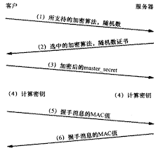

# 计算机网络安全

## 安全通讯的特性

- 机密性

  即使信息被截取,也无法破解看懂加密信息

- 报文完整性

  完整内容

- 端点鉴别

  接收方身份鉴别

- 运行安全性

## 术语

- **明文** 未被加密的报文
- **加密算法** 就是加密的方式
- **密文** 加密后的报文
- **对称秘钥系统** 密匙必须是秘密的,对于加密解密双方, 秘钥是相同的.
- **公开密钥系统** 分为公钥和私钥

## 对称密钥系统

### 凯撒密码

就是向后移动 k 位数

## 公开秘钥加密

基于当今的互联网而设计的加密算法,原因在于,对称秘钥系统需要双方提前面基,约定要私钥,才能通讯.但是当今互联网环境中,显然无法做到双方提前面基约定秘钥.于是,公开秘钥加密孕育而生.

### 公开秘钥密码使用方式

Alice 和 bob 要通讯,

假定:

- Alice 和 bob 未曾面基
- Alice 和 bob 并未共享秘钥
- bob 有两个密钥,
  - **公钥**,Alice 和如入侵者都可以在公网上下载的**公钥**,Kb+代表公钥
  - **私钥**,这是只有 bob 才有的, Kb-代表私钥,
- 公钥加密,私钥解密,Alice 用一套众所周知的加密算法和公钥进行加密`Kb+(m)`,bob 用私钥以及一套众所周知的解密算法进行解密.`Kb-(Kb+(m)) = m`,这之后 Bob 就拿到了原文.但是这里得到了一个神奇的结果`Kb-(Kb+(m)) = Kb+(Kb-(m)) = m`,也就是,这个加密解密反过来也是一样的.

在公钥系统中,加密是需要用数字签名将发送方和报文绑定的.

### RSA 算法

这个是公开密钥密码的代言词,RSA 广泛使用了 mod 运算,其实就是 `5%2 == 1`,求余数.

#### 三个恒等公式

```bash
[(a % n) + (b %  n)] % n =  (a + b)  % n  # 10 + 5, 3 => 0
[(a % n) - (b %  n)] % n =  (a - b)  % n  # 10 - 5, 3 => 2
[(a % n) * (b %  n)] % n =  (a * b)  % n  # 10 * 5, 3 => 2
```

进而推出第三个公式 `(a%n)^d % n = a^d % n`

## 使得 TCP 连接安全: SSL

其实 SSL 就是安全加强版本的 TCP 连接,他有自己的完整的三次握手以及四次挥手.

- **安全套接字层** (Secure Socket Layer, SSL)

- **运输层安全性** (Transport Layer Security, TLS)

SSL 提供了一个简单,具有套接字的应用编程接口,虽然 SSL 运行在应用层,但是它是 TCP 协议的加强层,相当于加了个套.

### SSL 的宏观描述

3 个阶段

- 握手

  - 与 alice 创建一条 TCP 连接
  - 验证 Alice 身份真实性
  - 发给 alice 主密钥,Bob 和 Alice 持有该主秘钥生成 SSL 会话所需要的所有对称密钥,一旦加强版 TCP 连接建立了,Bob 就会向 Alice 发一条报文,然后 Alice 响应 CA 证书,这个 CA 证书包含了公钥,由于这个 CA 证书已经被公共机构证实了,所以 Bob 知道了这个公钥属于 Alice.接着 Bob 生成一条仅用于此次对话的主密钥(MS),用 Alice 的公钥加密这条密钥(EMS),将这条 EMS 发给 Alice, Alice 用它的私密钥解密这条密钥得到 MS.
    

- 秘钥导出
  上面过程,原则上说,Alice 和 Bob 都知道了 MS,他们作用于后续所有的加密和数据完整性检查的对称会话密钥.然后 Alice 和 Bob 都是用 MS 来生成 4 个密钥.其中两个密钥用于加密解密数据,另外两个密钥用于验证数据完整性.

- 数据传输

## 总结

这块需要比较多的数学知识,如果只能记住一件事,那就记一下 ssl 加密过程的实现.SSL加密解密过程复杂的一笔,理解都成问题,更何况滴水不漏, 谁能试图去找漏洞我都服.
